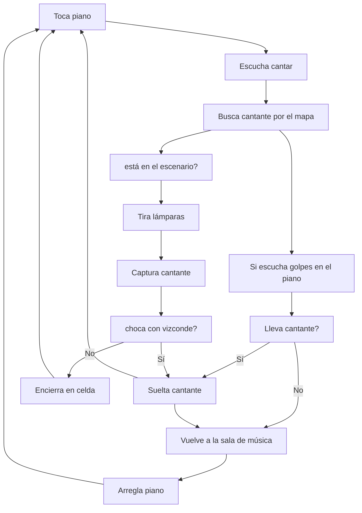
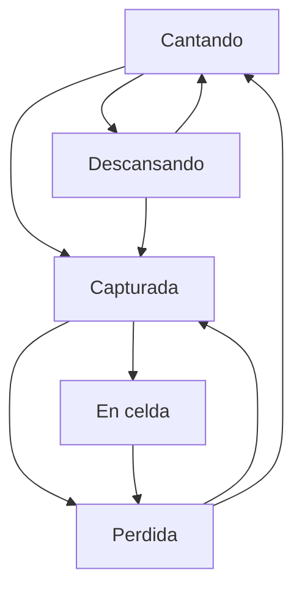
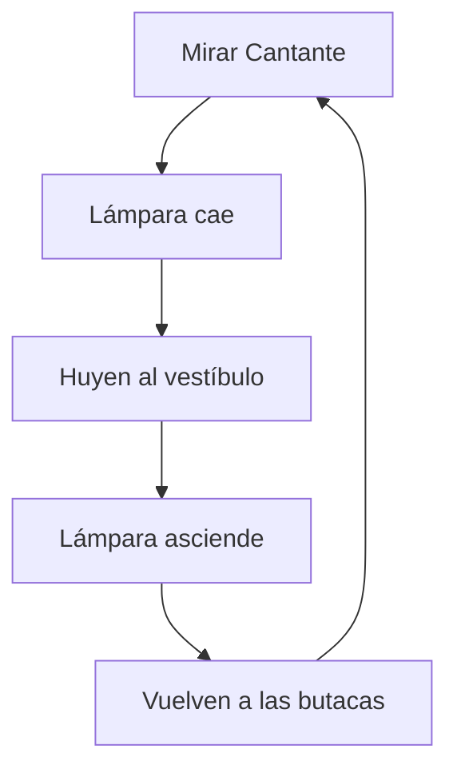

# **IAV - Decisión**

## Autores
- Pablo Arredondo Nowak (PabloArrNowak)
- Mario Miguel Cuartero (mamigu05)

## Propuesta
A partir de la base proporcionada, se deben diseñar e implementar soluciones para los siguientes comportamientos, indicados en https://narratech.com/es/inteligencia-artificial-para-videojuegos/decision/historias-de-fantasmas/ :

**Fantasma**: Inicialmente se encuentra en la sala de música completamente parado. Su objetivo principal es secuestrar a la cantante y encerrarla en una celda. Para ello, éste se moverá por todas las estancias dónde podrá interactuar con los objetos que vaya encontrando. Puede tener una gran variedad de interacciones y de misiones con el objetivo de encerrar a la cantante como ahuyentar al público si deja caer una de las dos lámparas que se encuentran en el patio de butacas. Si se lleva a la diva en hombros, la llevará a la mazmorra utilizando el camino más corto. A su vez, si es confrontado por el vizconde, soltará a la cantante; y si el vizconde se dedica a romper muebles, el fantasma dejará todo lo que esté haciendo para ver qué ocurre y arreglar el desorden que ha causado.

**Avatar del jugador (Vizconde)**: Inicialmente se encuentra en el palco oeste, pudiendo moverse por el mapa controlado por el click izquierdo del ratón. Su objetivo es impedir que el fantasma secuestre a la cantante cueste lo que cueste. Para ello, podrá moverse por el mapa, rompiendo muebles con el fin de distraer al fantasma. Pero el fantasma también le entretendrá durante el camino: si deja caer una de las lámparas del patio de butacas, este las reparará para traer al público de vuelta; si la cantante es encerrada en la mazmorra, la rescatará desactivando las rejas y tendrá que llevarla a una sala que ella conozca. Además, puede intimidar al fantasma o chocarse con él si éste lleva a la cantante en brazos haciendo que la suelte de inmediato.

**Cantante**: Inicialmente se encuentra en el escenario. Irá alternando de salas entre el escenario y las bambalinas para descansar. Si ésta es llevada en hombros por el fantasma, será encerrada en la mazmorra, con la excepción de ser interrumpido por el vizconde, que la soltará de inmediato y si se encuentra en una sala que ella no conoce, empezará a merodear de estancia en estancia hasta que encuentre una que conozca o sea rescatada por el vizconde.

**Público**: Inicialmente se encuentran en la sala de butacas viendo a la cantante actuar. Si una de las lámparas del techo cae, correrán hacia el vestíbulo donde permanecerán hasta que sean arregladas por el vizconde. Si ven al fantasma en el escenario gritarán.

**Barcas**: Son el medio de transporte entre las salas de los sótanos, sólo pueden ser usadas por una persona a la vez, con la excepción de que la cantante sea llevada.

## Punto de partida
Se parte de un proyecto base de Unity proporcionado por el profesor aquí: 
https://github.com/Narratech/IAV-Decision

En esta escena se encuentran:

- **"Cameras"**, que es un “empty” padre de 4 cámaras que contiene un script “CameraManager” que permitirá cambiar entre las cámaras del fantasma, avatar, cantante o general.
- **“Ghost”**, que contiene un árbol de comportamiento que controla al fantasma y define todas las acciones inteligentes del personaje, algunas de ellas son: buscar el escenario donde se encuentra la cantante; llevársela hasta la mazmorra; volver a la sala de música; arreglar el piano y otras más (gran parte de las funciones están pendientes de implementar).
- **"Player"**, que puedes controlar con el ratón y hacer que se mueve por todo el mapa.
- **"Cantante"**, que contiene una máquina de estados que le hace alternar entre varias acciones como: quedarse de pie; cantar; descansar en las bambalinas… (gran parte de las funciones están pendientes de implementar).
- **"Mapa"**, que está compuesto por todas las estancias (patio de butacas, escenario, sala de música…), caminos (rampas y ríos), paredes y barcas que se encuentran en la escena.
- **“PublicoEmptyDcha” y “PublicoEmptyIzda”**, que contienen a cada personaje que compone el público y que a su vez tienen un script “Público” que controla su comportamiento.
- **“Blackboard”**, que es un objeto vacío que contiene un script “GameBlackboard” que tiene referencia a todas las variables del mundo necesarias para que otros objetos tengan acceso a éstas.
- **Palancas y piano**, que permiten ser controladas y usadas.
- **“Canvas”**, que una vez ha comenzado el juego muestra por pantalla información sobre el movimiento; el control de cámaras; e información del input de teclado.

## Diseño de la solución

El diágrama del **árbol de comportamiento** del **fantasma** tendría esta estructura

El diágrama de la **máquina de estados** de la **cantante** tendría esta estructura

El diágrama del comportamiento del **público** sería así

## Pruebas y métricas

- [Vídeo con la batería de pruebas]

## Producción

Las tareas se han realizado y el esfuerzo ha sido repartido entre los autores.

| Estado | Tarea | Fecha |
| :----: | :---: | :---: |
| ✔  | ReadMe: Propuesta | 23-03-2023 |
| ✔  | ReadMe: Punto de partida | 23-03-2023 |
| ✔  | Primeros scripts fantasma | 02-04-2023 |
| ✔  | Público y piano scripts | 02-04-2023 |
| ✔  | GhostTreeBehaviour inicial | 11-04-2023 |
| ✔  | SingerStateMachine inicial | 13-04-2023 |
| ✔  | Característica C: Cantando y Descansando | 13-04-2023 |
| ✔  | Característica D: Fantasma activa palancas lámparas | 15-04-2023 |
| ✔  | Característica B: Comportamiento público | 15-04-2023 |
| ✔  | Característica D: Fantasma secuestra a cantante | 15-04-2023 |
| ✔  | Característica D: Fantasma encierra a cantante | 15-04-2023 |
| ✔  | Característica C: Cantante sigue a fantasma | 15-04-2023 |
| ✔  | ReadMe: Diagramas | 16-04-2023 |
| ✔  | Característica C: Cantante sigue a vizconde | 16-04-2023 |
| ✔  | Característica D: Fantasma hace su ciclo | 16-04-2023 |
| ✔  | Característica D: Cantante hace su ciclo | 16-04-2023 |
| ✔  | Código: comentarios | 16-04-2023 |
| ✔  | ReadMe: FIN | 16-04-2023 |
| ✔  | Ejecutable y vídeo | 16-04-2023 |
